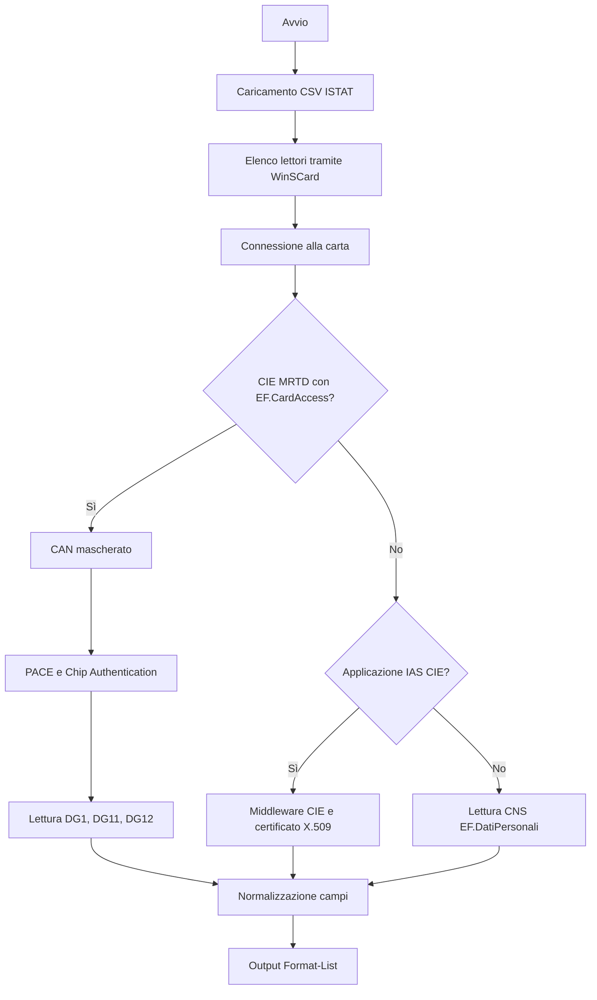

# Architettura

## Obiettivo e confini

`LettoreCNS.ps1` è uno script interattivo Windows. Usa l'API PC/SC di sistema
per individuare lettori e carte, identifica il profilo disponibile e mostra un
oggetto PowerShell formattato. Non espone un servizio, non apre porte di rete e
non persiste automaticamente i dati letti.

L'ordine di rilevamento MRTD → IAS → CNS è intenzionale. Su alcune CIE una
selezione del filesystem CNS modifica l'applicazione corrente e può nascondere
`EF.CardAccess` fino al successivo reset RF.

## Componenti

### PC/SC nativo

La classe C# incorporata `CnsPcscNative` importa da `winscard.dll` le funzioni
necessarie a creare il contesto, elencare i lettori, connettere la carta,
trasmettere APDU e rilasciare le risorse. `Send-Apdu` gestisce le risposte
`6Cxx` e `61xx` con limiti espliciti.

### CNS e TS-CNS

Il programma seleziona MF `3F00`, DF1 `1100` ed `EF.DatiPersonali` `1102`,
verifica la lunghezza dichiarata e interpreta i campi ASCII. Il CSV ISTAT
risolve codici catastali e numerici senza chiamate esterne.

### CIE MRTD

`lib/CIE.MRTD.SDK.dll` verifica la disponibilità di PACE, riceve il CAN, legge
DG14 ed esegue Chip Authentication. Solo dopo legge DG1, DG11 e DG12. Il parser
BER-TLV estrae e normalizza MRZ, anagrafica, residenza, autorità e date.

Non viene letta la fotografia e non viene eseguita la Passive Authentication di
`EF.SOD`; l'autenticità dell'emittente e l'integrità firmata dei Data Group non
sono quindi verificate dal programma.

### CIE IAS

Il programma seleziona l'AID IAS, legge `EF.ID_Servizi` e interroga
`CIEPKI.dll`. Se la CIE non è già abilitata nel profilo Windows, richiede il PIN
e chiama il Middleware CIE. I dati sono ricavati dal certificato X.509 associato
alla carta nello store `CurrentUser\My`.

## Confini di fiducia ed effetti collaterali

| Elemento | Fiducia richiesta | Effetto |
| --- | --- | --- |
| `LettoreCNS.ps1` | codice revisionato dall'utente | coordina lettura e visualizzazione |
| `winscard.dll` e driver | Windows e produttore del lettore | accesso al dispositivo PC/SC |
| `CIE.MRTD.SDK.dll` | hash e sorgente documentati | PACE, EAC e parsing MRTD |
| `CIEPKI.dll` | Middleware CIE ufficiale | possibile abilitazione nel profilo utente |
| CSV ISTAT | provenienza e data del dataset | risoluzione locale dei comuni |
| console/processo | postazione attendibile | contiene temporaneamente dati personali |

## Gestione delle risorse

Handle PC/SC, memoria non gestita, oggetti certificato e connessioni SDK sono
rilasciati in blocchi `finally`. PIN e CAN non vengono stampati; alcuni passaggi
richiedono tuttavia rappresentazioni in memoria di processo, descritte in
[PRIVACY.md](PRIVACY.md).
